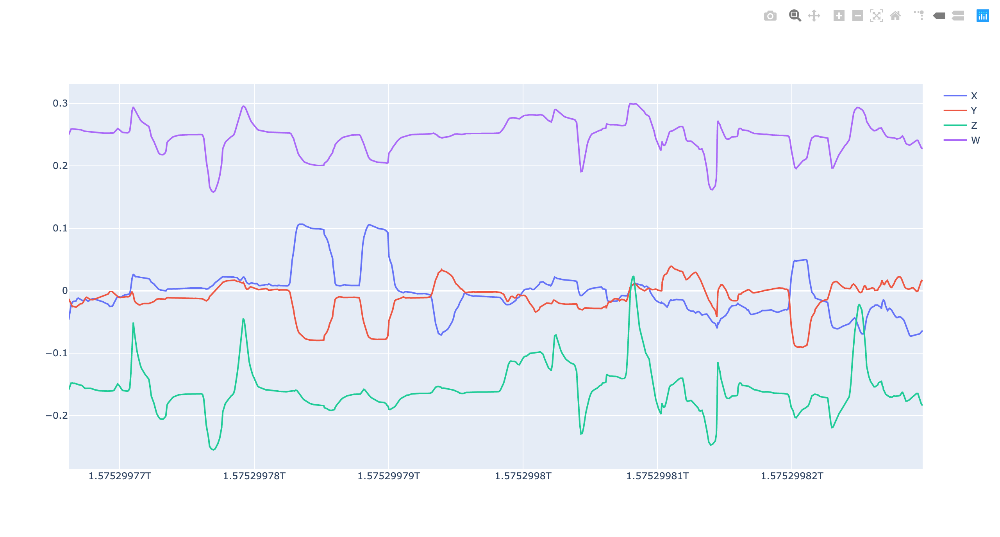

# CSV Plotter

Small script that plots your csv data in a browser.

## Setup
Make sure that you have Python (version 3) installed, alongside with modules: pandas & plotly.
```
brew install python3
pip3 install pandas
pip3 install plotly
```

## How to use

1. Paste your csv data in `data.csv`. Make sure that the first line represents column names.

Example:
```
timestamp,x,y,z,w
1575299766209,-0.04618,-0.01304,-0.15839,0.25022
1575299766295,-0.03460,-0.01707,-0.15219,0.25563
...
```

2. Modify `script.py` with your column names.

Example:
```
figure.add_trace(go.Scatter(x=data['timestamp'], y=data['x'], name='X'))
figure.add_trace(go.Scatter(x=data['timestamp'], y=data['y'], name='Y'))
figure.add_trace(go.Scatter(x=data['timestamp'], y=data['z'], name='Z'))
figure.add_trace(go.Scatter(x=data['timestamp'], y=data['w'], name='W'))
```

3. Run with `python3 plot.py`.

4. See your graph in a browser.


